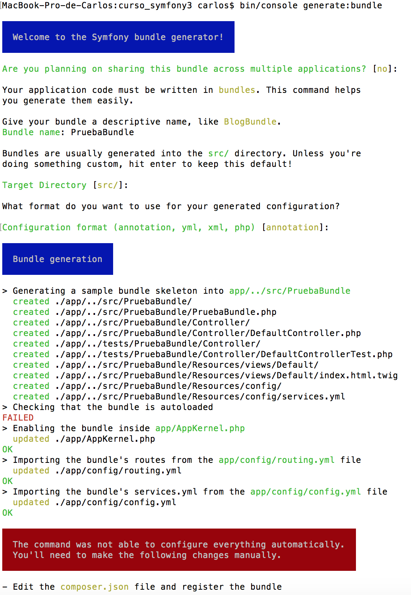

# Bundles

Una aplicación symfony viene con una colección de bundles preinstalados. 
Cualquier funcionalidad en una apliación symfony viene de un bundle.

Los Bundles se registran en el archivo app/AppKernel.php y cada uno de ellos 
proporciona funcionalidades y herramientas, mayoritariamente servicios.

```php
class AppKernel extends Kernel
{
    public function registerBundles()
    {
        $bundles = [
            new Symfony\Bundle\FrameworkBundle\FrameworkBundle(),
            new Symfony\Bundle\SecurityBundle\SecurityBundle(),
            new Symfony\Bundle\TwigBundle\TwigBundle(),
            new Symfony\Bundle\MonologBundle\MonologBundle(),
            new Symfony\Bundle\SwiftmailerBundle\SwiftmailerBundle(),
            new Doctrine\Bundle\DoctrineBundle\DoctrineBundle(),
            new Sensio\Bundle\FrameworkExtraBundle\SensioFrameworkExtraBundle(),
            new AppBundle\AppBundle(),
        ];

        if (in_array($this->getEnvironment(), ['dev', 'test'], true)) {
            $bundles[] = new Symfony\Bundle\DebugBundle\DebugBundle();
            $bundles[] = new Symfony\Bundle\WebProfilerBundle\WebProfilerBundle();
            $bundles[] = new Sensio\Bundle\DistributionBundle\SensioDistributionBundle();

            if ('dev' === $this->getEnvironment()) {
                $bundles[] = new Sensio\Bundle\GeneratorBundle\SensioGeneratorBundle();
                $bundles[] = new Symfony\Bundle\WebServerBundle\WebServerBundle();
            }
        }

        return $bundles;
    }
    // ...
}
```

## Bundles por defecto en una instalación Symfony

Como podemos ver, una aplicación symfony recién instalada viene con:

- 5 bundles de Symfony
- 1 bundle de Doctrine
- 1 bundle de SensioLabs
- el bundle propio de nuestra aplicación.

Además de otros 5 bundles utilizados únicamente para desarrollo (dev) y/o para testeo (test).


### FrameworkBundle

Implementa un framework MVC básico aunque robusto y flexible.


### SecurityBundle

Para la seguridad 

https://symfony.com/doc/current/reference/configuration/security.html


### TwigBundle

Para el sistema de plantillas twig. 

https://symfony.com/doc/current/reference/configuration/twig.html
https://twig.symfony.com/doc/2.x/


### MonologBundle

Para el sistema de logs


### SwiftmailerBundle

Para el envío de correos


### DoctrineBundle

ORM para el acceso a la base de datos.

https://symfony.com/doc/master/bundles/DoctrineBundle/index.html
http://docs.doctrine-project.org/en/latest/

### SensioFrameworkExtraBundle

Extiende las caractarísiticas de FrameworkBundle para añadirle anotaciones y convenciones adicionales.

- @Route y @Method
- @ParamConverter
- @Template
- @Cache
- @Security

http://symfony.com/doc/current/bundles/SensioFrameworkExtraBundle/index.html


### AppBundle

El Bundle propio de nuestra aplicación


### DebugBundle

The DebugBundle allows greater integration of the component into the Symfony full-stack framework. It is enabled by default in the dev and test environment of the Symfony Standard Edition.

Since generating (even debug) output in the controller or in the model of your application may just break it by e.g. sending HTTP headers or corrupting your view, the bundle configures the dump() function so that variables are dumped in the web debug toolbar.

But if the toolbar cannot be displayed because you e.g. called die/exit or a fatal error occurred, then dumps are written on the regular output.

In a Twig template, two constructs are available for dumping a variable. Choosing between both is mostly a matter of personal taste, still:

 is the way to go when the original template output shall not be modified: variables are not dumped inline, but in the web debug toolbar;
on the contrary, {{ dump(foo.bar) }} dumps inline and thus may or not be suited to your use case (e.g. you shouldn't use it in an HTML attribute or a <script> tag).

http://symfony.com/doc/current/reference/configuration/debug.html
http://symfony.com/doc/current/components/var_dumper.html


### WebProfilerBundle

Introduce una barra de debug y de profile en la parte inferior de las páginas cuando se ejecutan con el entorno de *dev*.

https://symfony.com/doc/current/reference/configuration/web_profiler.html


### SensioDistributionBundle

- Añade el security checker (./bin/console security:check)
- Composer Hooks. Al realizar composer install o composer update, se realizan las siguientes tareas:
  - Actualiza el archivo bootstrap.php.cache y borra la caché.
  - Instala los assets en el directorio web


https://github.com/sensiolabs/SensioDistributionBundle

### SensioGeneratorBundle

Este bundle proporciona los comandos de consola de generación automática de varios 
elementos para ahorrarnos tiempo en la programación.

- Generar un Bundle
- Generar un Command
- Generar un Controller
- Generar un CRUD Controller basado en una entidad de Doctrine
- Generar un Doctrine Entity Stub
- Generar un Form Type Class basado en una entidad de doctrine

https://symfony.com/doc/master/bundles/SensioGeneratorBundle/index.html

### WebServerBundle

PHP 5.4 introdujo un servidor web integrado que se puede utilizar para ejecutar 
aplicaciones PHP localmente durante el desarrollo sin necesidad de tener un servidor
web instalado.

Este bundle añade comandos para controlar dicho servidor web.

Desde symfony 3.3, si no se pasa el puerto como parámetro, el comando server:start 
utiliza el primer puerto libre disponible entre el 8000 y el 8100.

$ bin/console server:start
  [OK] Web server listening on http://127.0.0.1:8024

http://symfony.com/blog/new-in-symfony-3-3-webserverbundle


## Creación de un bundle

Podemos crear un bundle a mano, o generarlo con el comando *generate:bundle* de 
la consola.

> bin/console generate:bundle

NOTA: Desde la versión 3.2, hay un *bug* relacionado con la autocarga de clases.
Symofny alerta de ello al generar el bundle:



Para solucionarlo, editamos a mano la sección autolad del fichero composer.json

```json
    "autoload": {
        "psr-4": {
            "AppBundle\\": "src/AppBundle",
            "PruebaBundle\\": "src/PruebaBundle"
        },
```

Y ejecutamos el comando *install* de composer

> composer install

Composer volverá a crear el algoritmo para la autocarga incluyendo el nuevo 
directorio *src/PruebaBundle*


Las otras tareas que ha realizado el comando generate:bundle por nosotros son:

- Crear el direcotorio src/PruebaBundle con un controlador, un twig y un fichero services.yml
- Crear el directorio test/PruebaBundle para testear el bundle
- Habilitar el bundle en el app/AppKernel
- Incluir en el routing.yml el fichero routing.yml del nuevo bundle
- Incluir en el config.yml el fichero services.yml del nuevo bundle

