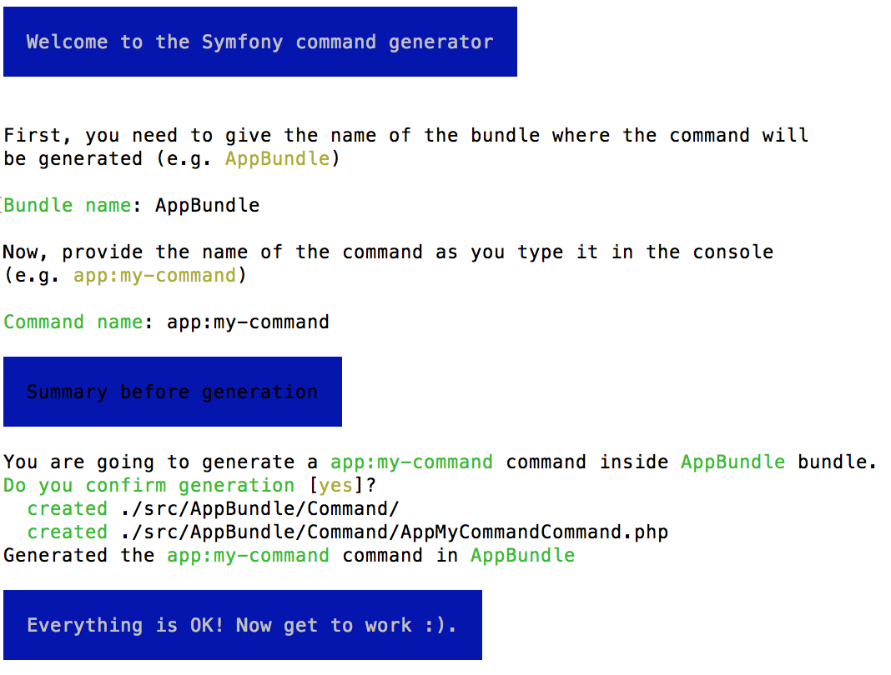

# La consola de symfony

Symfony proporciona un montón de comandos a través del script *bin/console* que 
nos facilitan la tarea de desarrollo.

Además de estos comandos ya existentes, podemos programar e incluir tantos 
comandos nuevos como deseemos.


## Creación de un comando de consola

Los comandos se deben crear en clases bajo el namespace *Command* de nuestro
bundle (por ejemplo AppBundle\Command) y los nombres de los comandos deben terminar
con el sufijo Command.

La propia consola tiene un comando para crear comandos:

> bin/console generate:commmand



El archivo generado es el siguiente:

```php
// src/AppBundle/Command/AppMyCommandCommand.php
<?php

namespace AppBundle\Command;

use Symfony\Bundle\FrameworkBundle\Command\ContainerAwareCommand;
use Symfony\Component\Console\Input\InputArgument;
use Symfony\Component\Console\Input\InputInterface;
use Symfony\Component\Console\Input\InputOption;
use Symfony\Component\Console\Output\OutputInterface;

class AppMyCommandCommand extends ContainerAwareCommand
{
    protected function configure()
    {
        $this
            // El nombre del comando 
            ->setName('app:my-command')
            // La descripción que aparece al ejecutar "php bin/console list"
            ->setDescription('...')
            // El texto de ayuda cuando se ejecuta el comando con --help
            ->setHelp('...')
            // Argumentos
            ->addArgument('argumento1', InputArgument::OPTIONAL, 'Descripción del argumento 1')
            // Opciones
            ->addOption('option', null, InputOption::VALUE_NONE, 'Option description')
        ;
    }

    protected function execute(InputInterface $input, OutputInterface $output)
    {
        $argument = $input->getArgument('argument');

        if ($input->getOption('option')) {
            // ...
        }

        $output->writeln('Command result.');
    }

}
```

### Configuración del comando

Lo primero de todo es configurar el comando en el método *configure()*:

- Nombre del comando
- Descripción del comando
- Texto de ayuda 
- Argumentos
- Opciones


Una vez configurado, ya lo podemos ejecutar.

> bin/console app:my-command

Como es de esperar, el comando no hará nada todavía.

La lógica del comando está en el método *execute()*.

### Console Output

```php
// ...
protected function execute(InputInterface $input, OutputInterface $output)
{
    // Salida multilínea (introduce un \n al final de cada línea)
    $output->writeln([
        'Mi comando personalizado',
        '========================',
        '',
    ]);

    // Salida de una línea seguida de "\n"
    $output->writeln('¡Genial!');

    // Salida SIN introducir \n
    $output->write('Estás ejecutando ');
    $output->write('un comando personalizado.');
}
```


### Console Input

El objeto Input nos permite acceder a los argumentos y a las opciones.

#### Argumentos

Hay 3 variantes de argumentos:

- InputArgument::REQUIRED
El argumento es obligatorio. El comando falla si no se especifica el argumento.
- InputArgument::OPTIONAL
El argumento es opcional. Es el comportamiento por defecto.
- InputArgument::IS_ARRAY
El argumento puede tener cualquier número de valores. Si hay algún elemento así, debe 
ser utilizado el último de la lista de argumentos.

Se puede combinar IS_ARRAY con REQUIRED y OPTIONAL de la siguiente forma:

```php
$this
    // ...
    ->addArgument(
        'names',
        InputArgument::IS_ARRAY | InputArgument::REQUIRED,
        'Who do you want to greet (separate multiple names with a space)?'
    );
```


#### Opciones


Hay 4 variantes de opciones:

- InputOption::VALUE_IS_ARRAY
Esta opción aceptaría múltiples valores (ej: --dir=/foo --dir=/bar).
- InputOption::VALUE_NONE
Esta opción no aceptaría ningún valor (ej: --yell). Es el comportamiento por defecto.
- InputOption::VALUE_REQUIRED
Esta opción necesita un valor obligatorio (ej: --iterations=5). La opción en sí misma es opcional.
- InputOption::VALUE_OPTIONAL
Esta opción puede tener valor o no tenerlo (e.g. --yell or --yell=loud).

Se puede combianr VALUE_IS_ARRAY con VALUE_REQUIRED o con VALUE_OPTIONAL de la siguiente forma:

```php
$this
    // ...
    ->addOption(
        'colors',
        null,
        InputOption::VALUE_REQUIRED | InputOption::VALUE_IS_ARRAY,
        'Which colors do you like?',
        array('blue', 'red')
    );
```

### Acceso al contenedor de servicios


```php
// ...
use Symfony\Bundle\FrameworkBundle\Command\ContainerAwareCommand;

class CreateUserCommand extends ContainerAwareCommand
{
    // ...

    protected function execute(InputInterface $input, OutputInterface $output)
    {
        // ...

        // access the container using getContainer()
        $userManager = $this->getContainer()->get('app.user_manager');
        $userManager->create($input->getArgument('username'));

        $output->writeln('User successfully generated!');
    }
}
```


## Ejecutar un comando de consola desde otro comando

Ejectuar un comando dentro de otro comando es sencillo:

```php
use Symfony\Component\Console\Input\ArrayInput;
// ...

protected function execute(InputInterface $input, OutputInterface $output)
{
    $command = $this->getApplication()->find('demo:greet');

    $arguments = array(
        'command' => 'demo:greet',
        'name'    => 'Fabien',
        '--yell'  => true,
    );

    $greetInput = new ArrayInput($arguments);
    $returnValue = $command->run($greetInput, $output);

    // ...
}
```

La salida del comando se guarda en $output y en $returnValue estará el return que 
haya hecho el método *execute()* del comando.


## Ejecutar un comando desde un controlador

Ejectuar un comando desde un controlador (o desde un servicio) también es muy 
sencillo:

```php
// src/AppBundle/Controller/SpoolController.php
namespace AppBundle\Controller;

use Symfony\Bundle\FrameworkBundle\Console\Application;
use Symfony\Bundle\FrameworkBundle\Controller\Controller;
use Symfony\Component\Console\Input\ArrayInput;
use Symfony\Component\HttpFoundation\Response;
use Symfony\Component\HttpKernel\KernelInterface;

class SpoolController extends Controller
{
    public function sendSpoolAction($messages = 10, KernelInterface $kernel)
    {
        $application = new Application($kernel);
        $application->setAutoExit(false);

        $input = new ArrayInput(array(
           'command' => 'swiftmailer:spool:send',
           'fooArgument' => 'barValue',
           '--message-limit' => $messages,
        ));

        $returnValue = $application->run($input, $output);
        
        // ...
    }
}
```


http://symfony.com/doc/current/console.html