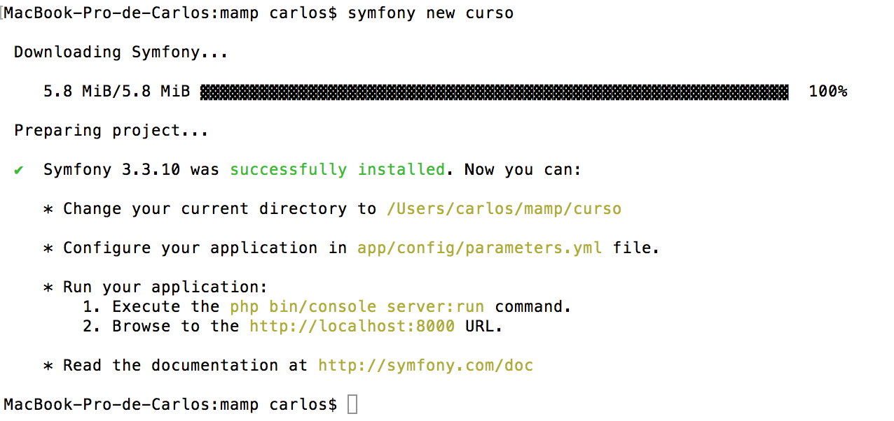

# Instalación


## Crear un proyecto nuevo.

### Instalar la aplicación Symfony Installer

Symfony dispone de una aplicación llamada Symfony Installer a través de la cuál se pueden
instalar/crear un proyecto symfony desde 0.

http://symfony.com/doc/current/setup.html

### Crear un proyecto

```
symfony new curso_symfony3
```

Este comando crea un directorio llamado curso_symfony3/ que contiene un proyecto vacío basado en la versión
de symfony estable más reciente disponible.

Además chequea si tu sistema está bien configurado para ejecutar aplicaciones Symfony. Si no lo está, aparecerá
una lista con los cambios necesarios para cumplir todos los requisitos.



Se puede crear un proyecto con una versión de Symfony específica

```
symfony new curso_symfony3 3.1
```

### Ejecutar la aplicación symfony

Symfony viene con un servidor built-in para el desarrollo. Este servidor se puede lanzar 
ejecutando el siguiente comando desde la raíz del proyecto:


```
php bin/console server:run
```

http://localhost:8000/


### La consola de Symfony

Symfony proporciona un montón de comandos a través del script *bin/console* que 
nos facilitan la tarea de desarrollo.


## Instalar un proyecto ya existente

### Descargar el proyecto a través de GIT


```
git clone url_proyecto
```


### Instalar las dependencias a través de composer

Desde la raíz del proyecto, ejecutar el siguiente comando de composer:

```
composer install
```

### Ejecutar la aplicación symfony


```
php bin/console server:run
```

http://localhost:8000/


## Chequeo de la configuración del sistema

Con la instalación, viene un archivo config.php que chequea la configuración de 
nuestro sistema.

http://localhost:8000/config.php


## Permisos de ficheros necesarios

Se necesitan permisos de escritura en la carpeta *var* para la caché y los logs.

http://symfony.com/doc/current/setup/file_permissions.html


## Actualizar versiones de librerías de symfony o de terceros

```
composer update
```

Comprobar vulnerabilidades de seguridad
---------------------------------------

La consola de symfony tiene también un comando para comprobar si alguna de nuestras 
dependencias tiene alguna vulnerabilidad se seguridad conocida.

```
php bin/console security:check
```


Integración de git con Symfony
------------------------------

Para añadir git a un proyecto cualquiera (symfony o de cualquier otro tipo), basta con 
lanzar los siguientes comandos:

```
git init
git add . (el instalador de symfony ya ha creado y configurado el archivo .gitignore)
git commit -m "Initial commit"
```

Con esto ya tenemos control de versiones.

Y Para subirlo a un repositorio como github, bitbucket o gitlab: 

```
git remote add origin https://github.com/carherco/curso_symfony3.git
git push -u origin master
```

No obstante, el instalador de symony ya nos da la integración con git hecha.


Integración de git con Symfony
------------------------------

Al instalar symfony con el instalador, ya viene integrado también con composer.


https://en.wikipedia.org/wiki/Comparison_of_source_code_hosting_facilities